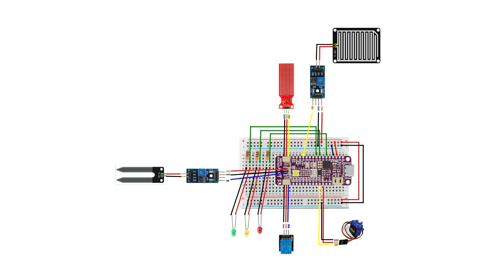

# No Fear of Water (NoFoW) (Smart Flood Monitoring and Alert System)

## Project Description  
The **No Fear of Water (NoFoW)** is a practical IoT-based solution designed to address urban flood challenges. This system mainly uses Maker Feather AIoT S3 as well as V-One Cloud Platform. This system utilizes a combination of sensors and actuators to monitor environmental conditions and provide early warnings that focuses on flooding. It contributes to the UN Sustainable Development Goal (SDG) 13: Climate Action and (SDG) 11: Sustainable Cities and Communities.

---

## Key Features  
- **Flood Detection**: Real-time monitoring of water levels and environmental factors.  
- **Early Warning System**: LED indicators for flood alerts.  
- **Automatic Valve Control**: Manages water flow using a servo motor.  
- **Environmental Monitoring**: Temperature, humidity, and soil moisture tracking.

---

## Prerequisites  
Ensure the following libraries and tools are installed:  

### Software Requirements
- **Arduino IDE**
  - Go to the **Sketch > Include Library > Manage Libraries**
  - Install these libraries:
    - **Arduino_JSON** by Arduino
    - **EspMQTTClient** by Patrick Lapointe
    - **Adafruit NeoPixel** by Adafruit
    - **DHT sensor library** by Adafruit
    - **PubSubClient** by Nick O'Leary
    - **ESP32Servo** by Kevin Harrington, John K. Bennett

  - Go to the **File > Preference > Settings > Additional boards manager URLs** 
    - Put the link below into the **Additional boards manager URLs**
    - https://raw.githubusercontent.com/espressif/arduino-esp32/gh-pages/package_esp32_index.json

  - Go to the **Tools > Boards > Boards Manager**
    - Install **esp32** by Espressif Systems

  - Go to [GitHub - CytronTechnologies/IoT-Kit-V-One](https://github.com/CytronTechnologies/IoT-Kit-V-One) and **download the ZIP file** for this IoT kit.
    - Go to **Sketch > Include Library > Add ZIP Library** and choose the ZIP file that have been downloaded.

- **V-One Account**
  - Login to the account
  - Go to **Device Manager > Device Types** and add these device types:
    - DHT11 IoT Kit
    - Moisture sensor IoT Kit
    - Rain sensor IoT Kit
    - Water Level sensor IoT Kit
    - Servo IoT Kit
  - Go to **Device Manager > Gateways** and create a new gateway
  - Go to **Device Manager > Devices** and add each of the devices mentioned before
    - **Note:** Make sure each of these devices uses the newly created gateway

### Hardware Requirements
- **Maker Feather AIoT S3 Microcontroller** 
- **Breadboard**
- **Jumper Wires**
- **DHT11 Sensor** (Temperature and Humidity)  
- **Water Level Sensor** (Water level measurement)  
- **Rain Sensor**  (Rain Detection)
- **Moisture Sensor**  (Soil Moisture)
- **3 LED (Green, Yellow, Red)** (Flood warning indicator)  
- **Servo Motor** (Automatic valve control)

---

## Setup Guide  

### 1. Hardware Setup 

1. Connect the sensors and actuators to the Maker Feather S3 as per the circuit diagram. 
    - **Note:** In the `/img` folder, there is a full diagram as well as connection guide in case some wiring in the diagram is not clear
2. Power up the microcontroller and ensure all connections are secure.

### 2. Software Setup  
1. Download this repository into zip file or copy the coding into the Arduino IDE
2. Navigate to the V-One libraries and modify the WiFi and gateway credentials.
    - It usually located at **Documents\Arduino\libraries\IoT-Kit-V-One-main** 
    - Open the **vonesetting** file using Notepad or any text editor.
    - Change the **WiFi SSID**, **WiFi Password**, **Gateway Access Token** and **Gateway ID** according to your credentials.
    - **Note:** Gateway Access Token and Gateway ID can be found in the V-One platform at **Device Manager > Gateways**.

---

## How to Run  
1. Open Arduino IDE  
2. Copy the code into the Arduino IDE or open the CPC357_Project_Code.ino file. 
3. Change the Device IDs in the code according to your own devices.
    - **Note:** These Device IDs can be found in the V-One platform at **Device Manager > Devices**
4. Change the pins according to your own hardware setup.
5. Connect the Maker Feather AIoT S3
6. Choose these corresponding board and COM port before uploading the code:
    - **Tools > Boards > esp32 > Cytron Maker Feather AIoT S3**
    - **Tools > Port > Your COM port**
      - **Note:** For the COM port, sometimes it will show a random name of an ESP32 board. Just ignore that name and just select that port.
    - **Tools > USB Mode > Hardware CDC and JTAG**
7. Upload the code

---

## Testing  
- Verify sensor readings individually before integrating them into the main system.  
- Simulate flood conditions by varying water levels to ensure proper detection and alerts.  
- Test servo motor functionality for valve control.  

---

## Sustainable Development Goals (SDG) Alignment  
This project supports **SDG 13: Climate Action** and **SDG 11: Sustainable Cities and Communities** by enhancing urban resilience to floods through innovative technology.

---

## Contributions  
We welcome contributions! Please submit pull requests or report issues for improvement.
